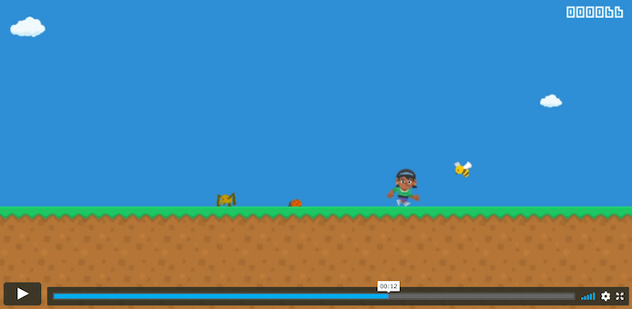

# Runner
The web version of the game is live at https://jayrave.github.io/runner/

This is my first attempt at building a game with animation! I decided to try my hand at using the [Entity Component System](https://en.wikipedia.org/wiki/Entity_component_system) architecture for this. These are the main modules:
- core: has the core game mechanics (everything except windowing & rendering)
- sdl2: uses [sdl2](https://github.com/Rust-SDL2/rust-sdl2) & core module for desktop builds
- quicksilver: uses [quicksilver](https://github.com/ryanisaacg/quicksilver) & core module for wasm builds 

Quicksilver can also do desktop builds, but I initially started the game with sdl2 & wanted to see if I could abstract it enough where I could have multiple front-ends. Turned out to be pretty exciting. Between those 2, I can target the majority of the platforms => Windows, Linux, MacOS, Android, iOS & Web.

## Build instructions
- sdl2: `cargo run`
- quicksilver: 
    - desktop: `cargo run --features desktop`
    - web: `cargo web start --features web`

## Assets
You can probably see that our sprite sheets carry quite a bit of extra sprites. It could be optimized by building a sheet with only the sprites we care about. I tried doing it but found it to be pretty manual & boring. Presumably, there are tools which can automate this (sprite builders, RON files etc.), but I haven't invested enough time in those yet. This way of just including the whole sprite sheet itself makes it pretty easy while developing. 

## Credits
- [Kenney](https://twitter.com/KenneyNL) for all his wonderful [assets](https://kenney.nl/assets)
- [Sunjay](https://twitter.com/Sunjay03) for his [tutorial](https://sunjay.dev/learn-game-dev/intro.html) that helped me get started
